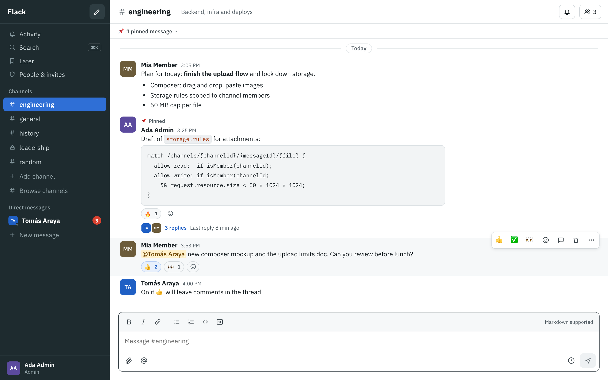

<p align="center">
  
</p>

<h1 align="center">Flack</h1>

<p align="center">
  <b>Team chat you own, running on your own Firebase project.</b><br />
  Channels, threads, DMs, search, reminders and push notifications in one installable app.<br />
  One command to install. Pay-as-you-go, and a small team usually pays <b>$0</b>.
</p>

<p align="center">
  <a href="https://shell.cloud.google.com/cloudshell/editor?cloudshell_git_repo=https%3A%2F%2Fgithub.com%2Fmvergarair%2Fflack&cloudshell_tutorial=docs%2Fcloudshell-tutorial.md&show=terminal"></a>
</p>

<p align="center">
  <a href="https://github.com/mvergarair/flack/actions/workflows/ci.yml"></a>
  <a href="https://github.com/mvergarair/flack/releases"></a>
  <a href="LICENSE"></a>
</p>

<p align="center">
  <a href="https://mvergarair.github.io/flack/">Website</a> ·
  <a href="#install">Install</a> ·
  <a href="#costs">Costs</a> ·
  <a href="#security">Security</a> ·
  <a href="#developing">Developing</a>
</p>

<p align="center">
  
</p>

## Features

- **Conversations:** public and private channels, 1:1 and group DMs, threads (with “also send to channel”), @mentions, `@here` and `@channel`.
- **Finding things:** ⌘K search across channels, people and messages, with filters by person, channel, date or files.
- **Later:** saved messages, `/remind me in 1h to …`, scheduled messages (`/schedule tomorrow 9am …`), snooze.
- **Notifications:** web push on desktop, Android and iPhone home-screen apps; per-channel levels; Do Not Disturb with schedules.
- **The small things:** reactions with your own quick picks, pins, mark unread, edit with ↑, typing indicators, online/away/last seen, custom status, profile cards with local time, link previews, file uploads up to 50 MB.
- **Admin:** invite-only (Google sign-in), invite links, roles, deactivate anyone instantly.
- **HTTP API:** read channels and messages, search, and post messages from scripts, CI and bots with personal API tokens ([docs/API.md](docs/API.md)).
- **Everywhere:** a single PWA for Mac, Windows, iPhone, Android and the browser, with light and dark themes.

## Install

You need a Google account with a **billing account** (see [Costs](#costs)). The installer
does the rest.

### Option A: Cloud Shell (nothing to install)

Click **Open in Cloud Shell** above. A tutorial opens next to a terminal that already has the
code and the Google Cloud SDK, and you're already signed in. Then run:

```bash
nvm install 22 && nvm use 22
npm run setup
```

### Option B: your computer

Requirements: Node.js 22+ and the [Google Cloud SDK](https://cloud.google.com/sdk/docs/install).

```bash
git clone https://github.com/mvergarair/flack
cd flack
npm run setup
```

### What the installer does

`npm run setup` (`scripts/install.sh`) asks for a **project id** (new or existing), a
**region**, **your email** (you become the first admin) and a **monthly budget alert**. It then:

1. creates the project, or uses yours, and links a billing account you pick;
2. turns on Firestore, the Realtime Database, Storage, Cloud Functions, Identity Platform and Hosting;
3. writes the app config (`scripts/project.env`, `web/.env.production`, `firebase/functions/.env.<project>`);
4. sets the budget alert and deploys everything.

It's safe to re-run. Sign-in happens in a repo-local config, so your other `gcloud` and `firebase` settings are never touched.

**One manual click.** Google doesn't let scripts turn on the Google sign-in provider. When the
installer finishes, open the link it prints (Firebase console → Authentication → Sign-in method)
and enable **Google**. Then open `https://<project>.web.app`, sign in with your email and invite
your team from **Admin**.

### After installing

- **Install the app.** Chrome and Edge: the install icon in the address bar. Safari on Mac: File → Add to Dock. iPhone: Share → Add to Home Screen. Android: ⋮ → Install app.
- **Notifications.** Avatar → Notifications → Turn on, on each device. On iPhone this only works in the Home Screen app (iOS 16.4+).
- **Same-origin sign-in on iPhone (optional).** To keep sign-in inside the installed iOS app, set `VITE_FIREBASE_AUTH_DOMAIN=<project>.web.app` in `web/.env.production`. Then add `https://<project>.web.app/__/auth/handler` to the OAuth client's redirect URIs (Google Cloud console → APIs & Services → Credentials) and redeploy.

### Updating

Run this in your Flack folder (in Cloud Shell: `cd flack` first):

```bash
npm run update
```

It pulls the latest version, installs dependencies, turns on any Google Cloud services the new
version needs and deploys. Your settings (`scripts/project.env`, `web/.env.production`,
`firebase/functions/.env.<project>`) are never overwritten, and open apps pick up the new
version by themselves. Admins see an **update available** note on the People & invites page
when a new [release](https://github.com/mvergarair/flack/releases) is out; see
[CHANGELOG.md](CHANGELOG.md) for what changed. Use **Watch → Custom → Releases** on GitHub to
get an email for each one.

On 1.0.0, run `git pull` once first: `npm run update` arrived in 1.1.0.

If you changed Flack's code yourself, `npm run update` stops before touching anything; merge
with `git pull`, then run it again. Contributors can use `npm run deploy`, which runs the full
test suite first (needs Java 21 and Playwright browsers).

## Costs

Flack needs Firebase's **Blaze** plan, which is **pay-as-you-go**. There's no monthly fee:
you pay only for usage above the free quotas, which renew every day or month. Flack is built to
stay inside them, and a team of 10–100 people normally does.

| Service | Free every day / month | A busy 25-person team |
|---|---|---|
| Firestore reads | 50,000 / day | ~20,000 / day |
| Firestore writes | 20,000 / day | ~3,000 / day |
| Cloud Functions | 2M runs / month | ~100k / month (incl. the 10-minute scheduler) |
| Storage (files) | 5 GB stored | depends on uploads |
| Realtime Database (presence, typing) | 1 GB stored, 10 GB downloaded / month | ~1 GB / month |
| Hosting | 10 GB stored, 360 MB / day transfer | a few MB per new device |
| Sign-in (Identity Platform) | 50,000 monthly users | 25 |

- **What you'll usually see:** a few cents a month for storing the Cloud Functions build images (Artifact Registry).
- **Past the free quotas:** a few cents per 100k database operations, and about $0.02–0.03 per GB of files per month.
- **Budget alert:** the installer creates one (US$5/month by default) that emails the billing account's admins at 50%, 90% and 100%. A budget alert doesn't cap spending; it tells you early.
- **Built-in cost guards:** 50-message history pages, count queries for unread badges, the offline cache, presence and typing in the Realtime Database, and a word index for search that costs nothing when idle.

## Security

Your data lives only in your Google Cloud project. There's no Flack server and no third party.

- **Rules are the backend.** Firestore, Storage and Realtime Database rules check the user's active claim *and* user doc, their role and channel membership on every request. A deactivated user is locked out immediately, even with a still-valid token. `firebase/rules-tests` has 100+ tests for them.
- **Invite-only.** The `beforeUserCreated` blocking function refuses Google accounts without a pending invite; `beforeUserSignedIn` refuses deactivated ones. Admin actions are callable functions that re-check the caller.
- **Files.** Files are downloaded through the SDK with the rules applied; nothing has a public URL. Attachment paths must sit in their message's own folder, and non-image files are always served as downloads.
- **Privacy of activity.** The channel you're viewing is write-only (only the notification function reads it), and typing indicators use a per-channel secret key.
- **Web hardening.** Markdown is sanitized with DOMPurify; hosting sends a strict Content-Security-Policy, `X-Frame-Options: DENY` and `nosniff`.

Found a problem? Please open a private security advisory on GitHub.

## API

Every deployment includes an HTTP API at `https://<project>.web.app/api/v1` for scripts, CI and
bots. Create a token in the app (avatar → **API tokens**), then:

```bash
curl -X POST https://<project>.web.app/api/v1/channels/CHANNEL_ID/messages \
  -H "Authorization: Bearer flk_…" -H "Content-Type: application/json" \
  -d '{"text": "✅ Deployed to production"}'
```

Tokens act as their owner (same channels, same rules), can be read-only, are stored only as a
hash and can be revoked anytime. Endpoints, errors and examples: [docs/API.md](docs/API.md).

## Keyboard shortcuts

| Keys | Action |
|---|---|
| ⌘K / Ctrl+K | Search: channels and people as you type (↑/↓ + Enter), plus messages and files |
| ⌥↑ / ⌥↓ | Previous / next channel |
| ⌥⇧↑ / ⌥⇧↓ | Previous / next unread channel |
| ↑ (empty composer) | Edit your last message |
| `/` (empty composer) | Commands: `/remind`, `/schedule` |
| `/remind me in 1h to …` | Set a reminder (`tomorrow at 9am …`, `friday 3pm …`, `… in 20 min`) |
| `/schedule tomorrow 9am …` | Schedule a message (without a time, the time picker opens) |
| ⌘B, ⌘I, ⌘⇧C | Bold, italic, inline code |

## Developing

Requirements: Node 22, Java 21+ (for the emulators) and `npx playwright install chromium webkit`.

```bash
npm install
npm run emulators      # Auth, Firestore, RTDB, Storage, Functions, Pub/Sub (UI on :4300)
npm run seed           # demo users, channels, a conversation, 200 old messages
npm run dev -w web     # http://127.0.0.1:5317
```

Seeded logins (emulators only; use the email/password form under the Google button, password `password123`):

| Email | Role |
|---|---|
| admin@flack.test | admin |
| member@flack.test, member2@flack.test | member |
| gone@flack.test | deactivated |
| invitee@flack.test | pending invite: `/invite/seed-invite-token-0001` |

Local work never touches a real project: the emulator project is `demo-flack`, and the `demo-`
prefix makes the SDKs refuse to reach real services. Emulator ports are non-default (Auth 9399,
Firestore 8380, RTDB 9300, Storage 9398, Functions 5301) so they don't clash with other projects.

| Command | What it runs |
|---|---|
| `npm run test:unit` | Vitest unit tests (markdown/XSS, parsing, scheduling, notification targeting…) |
| `npm run test:emu` | Security-rules tests for Firestore, Storage and RTDB, plus function tests, on the emulators |
| `npm run e2e` | Playwright end-to-end tests (Chromium, WebKit, iPhone and Pixel viewports) |
| `npm run verify` | All of the above plus typecheck and production build; `npm run deploy` requires it |

### Project fencing

`scripts/gcloud.sh` and `scripts/fb.sh` pin every command to the project in `scripts/project.env`
and use a repo-local config (`.gcloud/`), so work here can't affect your other Google Cloud
projects. If `.secrets/flack-deployer.json` exists, deploys use that service account;
otherwise they use the repo-local `firebase login` from `npm run setup`.

## How it works

| Path | Contents |
|---|---|
| `users/{uid}` | profile, `role`, `status` |
| `users/{uid}/{private,reads,activity,scheduled,saved,channelPrefs}` | per-user data, readable only by that user |
| `channels/{id}` | `public`, `private` or `dm` (DM ids are `dm_<sorted uids>`) |
| `channels/{id}/messages/{id}` | markdown text (mentions as `<@uid>`), thread summary, attachments, reactions |
| `search/{messageId}` | word index written by functions, read only by the `searchmessages` callable |
| RTDB `status/`, `viewing/`, `typing/` | presence, the channel on screen (private) and typing indicators |

- **Notifications:** `onmessagecreated` works out who to tell (DM members, mentions, thread participants, channel subscribers), writes Activity items and sends data-only web pushes. It skips people who are looking at the conversation or have Do Not Disturb on.
- **Scheduled messages and reminders:** `sendscheduled` runs every 10 minutes, and the app only offers times on that grid. Messages go out as the author through the normal pipeline. Membership is re-checked at send time; anything that can no longer be sent shows as *Not sent* under Later.
- **Search:** each message gets a separate index doc of accent-free words and word beginnings. Queries go through a callable that only searches channels you belong to.

## Contributing

Contributions are welcome, including ones made with AI coding agents. See
[CONTRIBUTING.md](CONTRIBUTING.md) for setup and the checklist, and [AGENTS.md](AGENTS.md) for the
rules agents should follow. Every pull request runs the full CI: shell-script lint, typecheck,
unit tests, a production build check, security-rules and function tests, end-to-end tests in
Chromium, WebKit and phone viewports, and CodeQL.

## License

[MIT](LICENSE). Flack is not affiliated with or endorsed by Slack or Google. Firebase is a trademark of Google LLC; Slack is a trademark of Slack Technologies, LLC.
